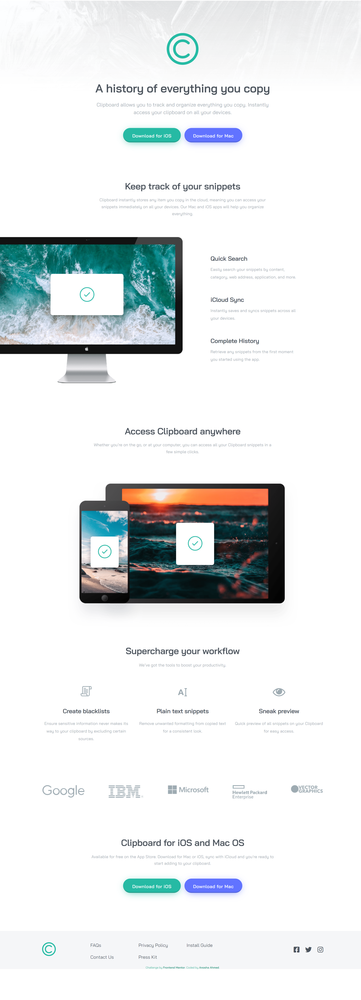
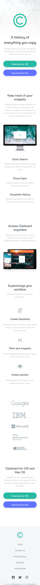

# Frontend Mentor - Clipboard landing page solution

This is a solution to the [Clipboard landing page challenge on Frontend Mentor](https://www.frontendmentor.io/challenges/clipboard-landing-page-5cc9bccd6c4c91111378ecb9). 

## Table of contents

- [Overview](#overview)
  - [The challenge](#the-challenge)
  - [Screenshots](#screenshots)
  - [Links](#links)
- [My process](#my-process)
  - [Built with](#built-with)
  - [What I learned](#what-i-learned)
  - [Continued development](#continued-development)
- [Author](#author)

## Overview

### The challenge

Users should be able to:

- View the optimal layout for the site depending on their device's screen size
- See hover states for all interactive elements on the page

### Screenshots

The desktop design VS My desktop solution 
 

 

The mobile design VS My mobile solution 
 

### Links

- Solution URL: [FrontEnd Mentor: My Solution](https://www.frontendmentor.io/solutions/clipboard-landing-page-sass-flexbox-responsive-mobilefirst-BJpuNk6fZ)
- Live Site URL: [GitHub Page: Clipboard Landing Page](https://anoshaahmed.github.io/fem12-clipboard-landing-page/)

## My process

### Built with

- Semantic HTML5 markup
- CSS custom properties
- Flexbox
- Mobile-first workflow
- Sass / SCSS

### What I learned

I put a lot of new things into practice in this solution, including Sass and animations.

One thing I wish I had done differently is not nesting. I don't know why I was nesting at first... maybe because I was using SCSS for the first time? But when it came to do media queries, it was so inconvenient to deal with specification etc. I'm gonna make sure not to do that again if I don't need to.

### Continued development

One problem I kept having, with this solution, was that every time I would save, and my live server would reload, the font-size of random paragraphs would appear larger than before I saved last time. And it was weird because I didn't even touch the font-size of those paragraphs. So, I would stop the live-server and open it again, and the font-size would be back to normal. Then I'd save again, and the font-size would appear larger. Ugh, it was such a hassle. I want to find out why that happened so I can avoid that from happening again.

Also, I want to get better at writing less CSS by using properties such as `mixin` and `extend`.

## Author

- Website - [Anosha Ahmed](https://www.anoshaahmed.com)
- Frontend Mentor - [@anoshaahmed](https://www.frontendmentor.io/profile/anoshaahmed)
- LinkedIn - [Anosha Ahmed](https://www.linkedin.com/in/anoshaahmed/)
- Twitter - [@anosha1ahmed](https://www.twitter.com/anosha1ahmed)
